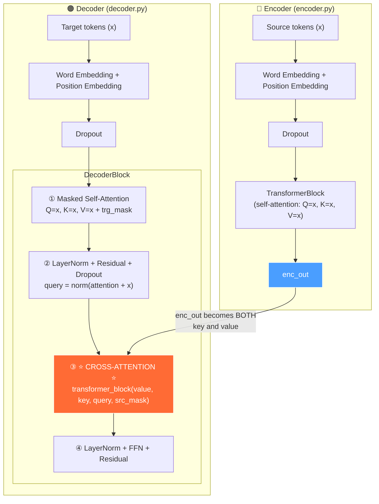
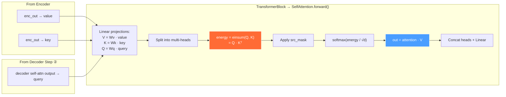

# Cross-Attention Flow: Encoder → Decoder

## End-to-End Sequence



## Zoomed In: What Happens at the Cross-Attention Step



## Mapping to Your Code

```
Encoder.forward(x, mask)
│
│  for layer in self.layers:
│      out = layer(x, x, x, mask)     ← self-attention (Q=K=V=x)
│                 ▲  ▲  ▲
│                 V  K  Q
│
└──► returns "out" (enc_out)
          │
          │  passed to DecoderBlock as "value" AND "key"
          ▼
DecoderBlock.forward(x, value=enc_out, key=enc_out, src_mask, trg_mask)
│
│  ① self.attention(x, x, x, trg_mask)     ← masked self-attention
│                   ▲  ▲  ▲
│                   V  K  Q  (all from decoder input)
│
│  ② query = dropout(norm(attention + x))   ← residual + norm
│
│  ③ self.transformer_block(value, key, query, src_mask)
│                            ▲      ▲    ▲
│                            │      │    └── from decoder (step ②)
│                            │      └─────── from encoder (enc_out)
│                            └────────────── from encoder (enc_out)
│
│        This is CROSS-ATTENTION:
│        Decoder queries "ask questions"
│        Encoder keys/values "provide answers"
│
└──► returns final output
```

> [!IMPORTANT]
> The **same `SelfAttention` class** handles both self-attention and cross-attention. The difference is purely in **what you pass as arguments**:
> - **Self-attention:** Q, K, V all come from the same source
> - **Cross-attention:** Q comes from decoder, K and V come from encoder

